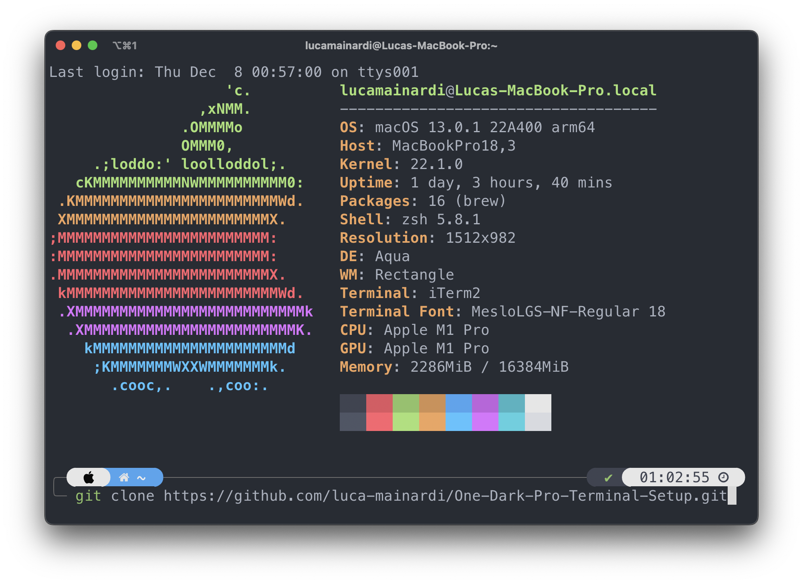

# One Dark Pro Terminal Setup

## Overview
Complete set up of the terminal that matches the [One Dark Pro Theme](https://github.com/Binaryify/OneDark-Pro) of visual studio code. Use [iTerm2](https://iterm2.com) and the [One Dark Pro  iTerm Theme](https://github.com/chinhsuanwu/one-dark-pro-iterm)



## How to Setup

### Install Homebrew
Open up a terminal window and install homebrew with the following command:

```console
/bin/bash -c "$(curl -fsSL https://raw.githubusercontent.com/Homebrew/install/HEAD/install.sh)"
```

### Add Homebrew To Path
After installing, add it to the path (replace "[username]" with your actual username):


```console
echo 'eval "$(/opt/homebrew/bin/brew shellenv)"' >> /Users/[username]/.zprofile
eval "$(/opt/homebrew/bin/brew shellenv)"
```

The commands are also listed at the end of the Homebrew installation.

### Install iTerm2
To install, run:
``` console
brew install --cask iterm2
```
Switch to iTerm2 for the remainder of this guide.

### Install Git
If you don't have it installed, install git as well:
```console
    brew install git
```

### Install Oh My Zsh
Run this to install Oh My Zsh:
```console
    sh -c "$(curl -fsSL https://raw.github.com/ohmyzsh/ohmyzsh/master/tools/install.sh)"
```

### Install PowerLevel10K Theme for Oh My Zsh
Run this to install PowerLevel10K:
```console
git clone --depth=1 https://github.com/romkatv/powerlevel10k.git ${ZSH_CUSTOM:-$HOME/.oh-my-zsh/custom}/themes/powerlevel10k
```
Alternatively, you can download it from homebrew:

```console
brew install romkatv/powerlevel10k/powerlevel10k
echo "source $(brew --prefix)/opt/powerlevel10k/powerlevel10k.zsh-theme" >>~/.zshrc
```

Now that it's installed, open the "~/.zshrc" file with your preferred editor and change the value of "ZSH_THEME" as shown below:
```console
ZSH_THEME="powerlevel10k/powerlevel10k"
```

### Install Meslo Nerd Font
Install the font by pressing "y" and then quit iTerm2

### Configure PowerLevel10K
Restart iTerm2. You should now be seeing the PowerLevel10K configuration process. If you don't, run the following:
```
p10k configure
```

Follow the instructions for the PowerLevel10K configuration to make your terminal look as desired.
In the instant prompt configuration select quiet (it will be needed for installing neofetch).

### Increase Terminal Font Size
1. Open iTerm2 preferences
2. Go to Profiles > Text
3. I increase my font size to about 18px

### Change iTerm2 Colors to One Dark Pro Theme
1. Open iTerm2 and move to Downloads folder
2. Download One Dark Pro color profile by running the following command (clone the repository in Downloads folder):

```console
git clone https://github.com/chinhsuanwu/one-dark-pro-iterm.git
```

3. iTerm2 > Preferences > Profiles > Colors
4. Open the Color Presets drop-down in the bottom right corner.
5. Select Import from the list.
6. Select the One Dark Pro.itermcolors file.
7. Select the One Dark Pro from Color Presets.

### Install Zsh Plugins
Install zsh-autosuggestions:
```console
git clone https://github.com/zsh-users/zsh-autosuggestions ${ZSH_CUSTOM:-~/.oh-my-zsh/custom}/plugins/zsh-autosuggestions
```
Install zsh-syntax-highlighting:
```console
git clone https://github.com/zsh-users/zsh-syntax-highlighting.git ${ZSH_CUSTOM:-~/.oh-my-zsh/custom}/plugins/zsh-syntax-highlighting
```
Open the "~/.zshrc" file in your desired editor and modify the plugins line to what you see below:
```console
plugins=(git zsh-autosuggestions zsh-syntax-highlighting web-search)
```

Load these new plugins by running:
```console
source ~/.zshrc
```

### Install Neofetch
To install, run:
``` console
brew install neofetch
```

To have neofetch run every time you open the terminal, add this line at the end of the ~/.zshrc file:
``` console
neofetch
```

### Default Terminal (Optional)
If you want to be able to display PowerLevel10K correctly also on the MacOS system terminal, follow these steps:

1. iTerm2 > Preferences > Profiles > Text
2. Click on the "change" button in the font settings
3. Select MesloLGS NF

You should now see all symbols correctly.

### Visual Studio Code Terminal (Optional)
Open settings.json and add this line:
``` console
"terminal.integrated.fontFamily": "MesloLGS NF"
```